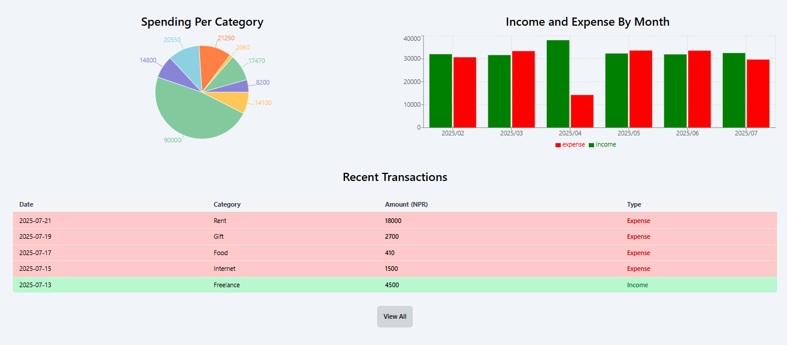
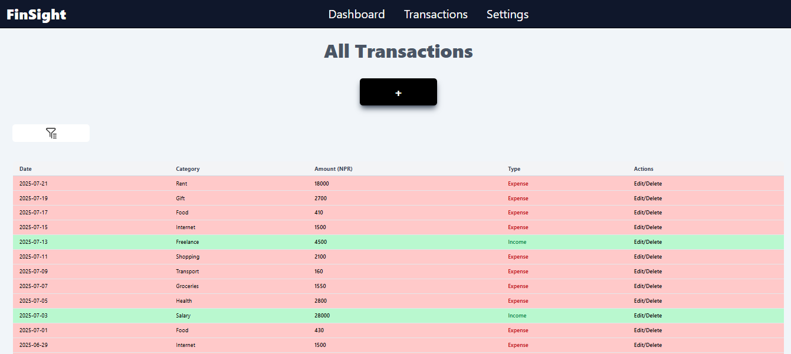

# FinSight

**FinSight** is a personal finance dashboard built using React where users can track their daily income and expenses and understand their spending patterns through visual charts.

It allows users to add, edit and delete transactions, manage categories, and view financial data clearly using line charts, bar charts and pie charts.

[Live Demo](https://)

---

## Preview

### Dashboard Page

### Transactions Page

### Settings Page

---

## Features

* View total income, total expenses and current balance on the dashboard.
* Line chart to visualize income and expense trends over time.
* Pie chart showing expenses based on category.
* Bar chart comparing total income vs expense.
* Add new transactions with type (income or expense) and category.
* Edit or delete transactions directly from the transaction list.
* Pagination (15 entries per page) to keep UI clean and readable.
* Dark mode toggle.
* Add or remove custom categories from settings.
* Confirmation modal before deleting transactions or categories.
* Dummy data for first-time users with option to reset all data.

---

## Key Technical Highlights

* Built reusable chart components using **Recharts**.
* Used **Dayjs** for date formatting and grouping transactions by time.
* Implemented pagination logic for handling large transaction lists.
* Managed application state for transactions and categories efficiently.
* Used **LocalStorage** to persist user data across page reloads.
* Created confirmation modals with background interaction disabled.
* Implemented inline editing for transaction amount, type and category.

---

## Challenges & Learnings

* Managing chart data updates after editing or deleting transactions.
* Handling category deletion while keeping transactions in sync.
* Designing a UI that stays readable with large amounts of data.
* Structuring logic cleanly without using a backend.
* Improving user experience with small details like modals and notifications.

This project helped me understand how real-world frontend applications handle data, UI state, and user interactions.

---

## Technologies Used

* **Frontend:** React, JavaScript
* **Styling:** Tailwind CSS
* **Charts:** Recharts
* **Date Handling:** Dayjs
* **Storage:** Browser LocalStorage

---

## Getting Started (Local Setup)

1. Clone the repository
2. Install dependencies using `npm install`
3. Run the project using `npm run dev`

---

## Future Improvements

* Add a backend for authentication and persistent storage.
* Sync data across devices.
* Export and import transactions as CSV.
* Improve performance for very large datasets.

---

## Author

**Amrit Paudel**

If you find any bugs or have suggestions for improvement, feel free to reach out.
